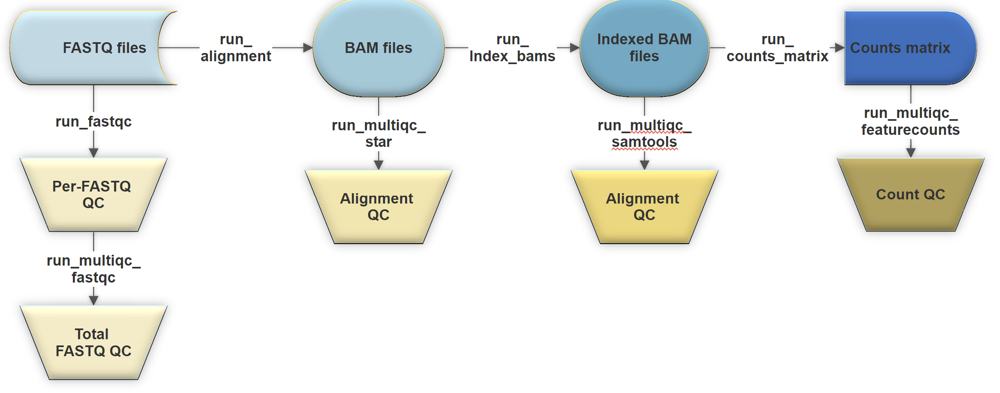

## RNA-Seq analysis workflow using High Performance Computing

Welcome to the repository for the course
*'RNA-Seq analyse workflow using High Performance Computing'*.

This course will be delivered online over two half-days:  

**Part 1: 09.30 - 12.30 9th November** \
**Part 2: 09.30 - 12.30 12th November**

Organiser: [**Dr Prasanth Sivakumar**](https://scholar.google.co.uk/citations?user=kggRsMsAAAAJ&hl=en) \
Contact: prasanth.sivakumar@kcl.ac.uk \
Bioinformatician with the
NIHR Biomedical Research Centre
Guy's and St Thomas' NHS Foundation Trust and King's College London
16th Floor Tower Wing
Guy's Hospital
Great Maze Pond, London SE1 9RT

## Workflow

## Contents

The repository contains a number of shell scripts, an R markdown file, and a subdirectory with examples. 

### Shell scripts

Each shell script is part of the RNA-Seq data processing pipeline to be used during the course. They are not standalone scripts, and must be used sequentially. They are not generalised, they are written to be easily understood and process a sample dataset. 

### Examples

The examples subdirectory contains example shell scripts for each process to be submitted to the HPC system. These scripts are not supposed to be run, rather they contain the stripped-back, bare essential examples of the functions. By removing the job scheduling parameters, the paths and directory settings, the loops, the basic use of the functions in the pipeline become simplified and clear. 

### R markdown

The R markdown file contains the code required to create a notebook containing the entire workflow from the counts matrix generated in the processing pipeline to the desired output of a differential gene expression dataset. This includes the basic workflow to achieve this, QC options to ensure the data is accurate and reliable for downstream analyses, and additional steps to further utilise the data. It has been written specifically to analyse the sample dataset. 

### The sample dataset
The raw data was obtained from the publication: [**"A Beginner's Guide to Analysis of RNA Sequencing Data"**](https://www.ncbi.nlm.nih.gov/pmc/articles/PMC6096346/]) \
The example dataset contains sequencing data from naive murine alveolar macrophages, comparing with those isolated from transplanted lungs 24 hours postreperfusion (n=4).

### Collaborations
There are numerous downstream analysis options available given the quality checked and cleaned differential gene expression data. These approaches must be tailored to requirements in a project-specific manner. If you are interested in conducting such analyses or potential bioinformatics collaborations, please contact **Dr. Mansoor Saqi**, Head of Translational Bioinformatics at the NIHR Biomedical Research Centre, at mansoor.saqi@kcl.ac.uk

